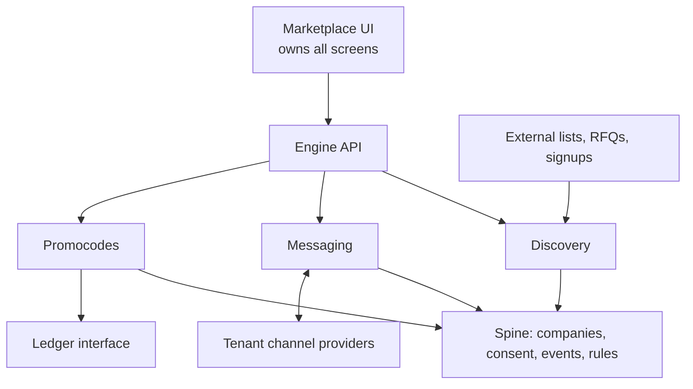
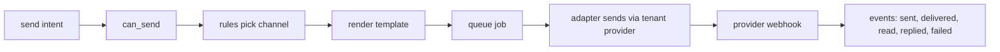
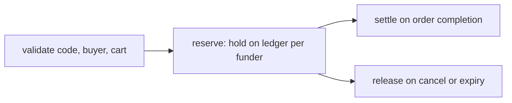

# Marketing Engine — v1 Architecture

As of 2026-09-20.

## Purpose and the one rule

The marketing engine is one standalone service that finds counterparties, sends messages and runs promocodes for its tenants. Clients (first among them the marketplace UI) call its API.

The engine service serves only JSON. An operator dashboard lives in `dashboard/` as a separate static app that talks only to the `/internal/` API and deploys as its own container; deleting it changes nothing in the engine.

The rule is keep it simple. Every choice below is the smallest thing that works today and can grow later without a rewrite. If a section here feels heavier than that, cut it.

What the marketplace gets from v1:

- Suppliers find corporate buyers who are not on the platform yet, and invite them in. Finding suppliers for an RFQ and matching among members are later scope.
- One send call covers SMS, email, WhatsApp and Telegram, with consent and each region's sending rules enforced automatically.
- Promocodes with rules, budgets and clear funding, reconciled against the ledger.

## Shape

One deployable, one Postgres database (Supabase), one HTTP API. A modular monolith: three modules on a shared spine, with hard boundaries in code so any module can be split out later.

Every row carries `tenant_id`. The API verifies a client-issued token and scopes every query by tenant; Postgres row-level security is the second line. Each module owns its tables and exposes one internal interface; modules never read each other's tables directly.

No message broker, no search cluster, no separate ledger service. Postgres does the queue too.

The engine is standalone and generic. A tenant is any organisation, a contact is any phone, email or handle, and the marketplace is one API client among possible others. Marketplace-specific and country-specific pieces (the RFQ listener, Wathq as one `CompanyLookup` implementation, the finance-engine ledger, Saudi sending rules) are connectors or rule rows behind interfaces: each can be swapped, added to or left out. Promocodes and ledger postings carry a currency. Messaging runs with no company registry at all, so it ships first and on its own.

## The spine

Four pieces, each a few tables and one function. Build only what the next module needs: events and consent come first for messaging; the registry comes when discovery does.

| Piece | Tables | The one function | Rule of thumb |
| --- | --- | --- | --- |
| Company registry | `companies` (platform-owned prospect pool of off-platform companies, shared), `company_identifiers` (CR, VAT, domain, phone, email), `company_sources` (where each fact came from), `tenant_company` (a tenant's own tags and notes) | `registry.upsert(company, identifiers, source)` | Strong identifiers (CR, VAT, domain) merge; weak ones (phone, email) link. Fuzzy name match links at 0.90 similarity, never merges. `merged_into` keeps merges legible. Marketplace members are not mirrored in. |
| Consent and suppression | `consent` (contact, channel, purpose, source, timestamp), `suppression` (opt-outs, bounces, complaints, legal blocks) | `can_send(contact, channel, purpose, tenant)` | The only door out. Messaging calls it; nothing bypasses it. |
| Event log | `events` (tenant_id, type, subject_type, subject_id, payload, occurred_at), append-only | `events.emit(...)` | Every module writes here. Analytics, client webhooks and audit all read from it. |
| Rules | `rules` (scope: platform / region / tenant, kind, document JSON) | `rules.evaluate(kind, context)` | Platform and region rules run first; tenants add rules but cannot remove them. |

Rule kinds in v1: `channel_selection`, `sending_window`, `promo_eligibility`, `match_score`. Add a kind when needed, not a new engine.

Sending constraints are region-scoped rules, not code. Every contact carries a `region` derived from its phone country code or email domain, and rules are scoped `platform` → `region` → `tenant`. Saudi rows in v1: registered sender IDs only, no promotional SMS outside allowed hours, mandatory unsubscribe text, no marketing to unconsented numbers. Quiet hours use the contact's time zone. Another country is another set of rows; nothing else changes.

## The three modules

Each module is a folder with its own tables, one service interface and a handful of API routes. No module has its own contact store, consent logic or event log; all of that is the spine.

### Messaging

The API takes an intent, not a channel: `send(tenant, contact, purpose, template, variables, preferred_channel?)`.

A contact is a raw address (E.164 phone, email, Telegram id) with an optional link to a company; messaging never depends on the registry.

Adapters implement one interface: `send`, `parseWebhook`, `validateCredentials`. Adding Telegram or a second SMS vendor is one adapter file. Tenant credentials live encrypted in `tenant_channel_configs`. Fallback (WhatsApp fails, try SMS) is a rule plus a retry, not new code.

### Discovery

Scope in v1: off-platform corporate buyers only. The registry holds a platform-owned prospect pool fed by imports, RFQ counterparties and lookups; marketplace members are not mirrored into it. A company that accepts an invite is marked as on-platform with the marketplace's reference, so the engine can recognise it later and stop suggesting it.

The matching algorithm is not decided. Discovery is built as a `Finder` interface: `find(tenant, query) → ranked candidates`, with one trivial implementation (filter on profile fields, no ranking) so the endpoints work end to end. Every search is logged with its query and result count so the eventual algorithm can be evaluated against real asks. The real algorithm, when chosen, is a second implementation of the same interface and nothing else changes. No PGroonga and no `match_score` rule in v1; trigram search from `pg_trgm` covers free text.

An invite is not a special thing. It is a message sent through the messaging module to a company with no account, carrying an invite token. When the marketplace reports the signup with that token, the company record is linked to the new account.

### Promocodes

Tables: `promocodes` (rules, budget, currency, validity), `promo_funders` (party, split %), `redemptions` (buyer, order, amount, currency, status, ledger reference).

The module never holds money. It posts hold, capture and release through one `Ledger` interface and stores the reference on the redemption, so both sides reconcile. The finance engine is the first implementation; a plain Postgres table is a valid one for a deployment with no external ledger.

## Open source picks

One language (TypeScript), one database (Postgres on Supabase), five npm packages. Nothing that runs as its own service.

| Package | Used for | Why it earns its place |
| --- | --- | --- |
| [pg-boss](https://github.com/timgit/pg-boss) (MIT) | Queue and outbox: sends, retries, hold expiry, outbound webhooks, cron | The only way to get retries and scheduling without Redis or a broker |
| [json-logic-js](https://github.com/jwadhams/json-logic-js) (MIT) | The rules layer: evaluate a JSON predicate against a context | 200 lines, no native code, rules are plain JSON in a table |
| [LiquidJS](https://liquidjs.com) (MIT) | Message templates tenants author | Sandboxed; tenant templates cannot run code |
| [Nodemailer](https://nodemailer.com) (MIT) | Email adapter over any SMTP credentials | Tenants plug in their own mail provider |
| [libphonenumber-js](https://www.npmjs.com/package/libphonenumber-js) (MIT) | Normalise every phone to E.164; derive `region` | Without it the registry fills with +966 / 05 duplicates |

Two Postgres extensions, both already on Supabase, both enabled from the dashboard: `pg_trgm` for fuzzy name matching and [PGroonga](https://supabase.com/docs/guides/database/extensions/pgroonga) for Arabic-capable search.

Two kinds of external HTTP APIs, called with plain `fetch`: [Wathq](https://developer.wathq.sa/en/apis) for CR lookup and search (behind `CompanyLookup`), and the channel providers (Taqnyat or Unifonic for SMS, Meta WhatsApp Cloud API, Telegram Bot API). Each adapter is one file of roughly 50 lines against a documented REST API; no provider SDKs.

Write yourself, because each is smaller than the dependency: the promocode schema (promotion, rules, budget, funders, redemptions), code generation (a 10-line function), webhook signing (HMAC-SHA256 in one function), CSV import (Node's built-in parser is enough).

API framework: Hono with Zod for validation and JWT verification via `jose`. One framework, nothing else.

## Infrastructure

One Node service on a normal container talking to the Supabase Postgres. Everything else is a library inside it.

- Postgres holds data, queue, events and rules. No Redis, no broker.
- One inbound webhook route per adapter for provider callbacks; one outbound webhook job type for clients.
- Idempotency keys on every write endpoint; providers and clients will retry.
- Row-level security on `tenant_id` behind the API's own scoping.
- OpenTelemetry traces from day one; it costs nothing later.

## Not in v1, and how it grows

Deliberately out: probabilistic identity matching, a visual rule builder, A/B tests (campaign scheduling arrived in step 11), per-tenant analytics beyond event queries, a search cluster, a second ledger.

Each fits a seam that already exists:

| Need later | Where it plugs in |
| --- | --- |
| New channel or SMS vendor | One new adapter file |
| New company source | One new ingest connector calling `registry.upsert` |
| New behaviour | A new rule kind, same evaluator |
| New country | Region-scoped rule rows |
| The real discovery algorithm | A second `Finder` implementation, one registry line, `FINDER` env |
| Better dedupe | Splink batch job proposing merges into the same registry |
| Rule authoring UI | Swap json-logic for GoRules ZEN Engine, which ships an open-source rule editor; the JSON migrates |
| Analytics or a data warehouse | Read the event log |
| A module outgrows the monolith | It already owns its tables and speaks through one interface; lift it out along that line |

If a future feature cannot be built through one of these seams, stop and ask why before adding a new mechanism.

## Roadmap

Eight steps, in order, each one brief and one pull request. Nothing starts until the step before it is done, and a step is done only when its check passes.

| Step | Build | Done when |
| --- | --- | --- |
| 1. Skeleton. Done 2026-09-20 | Hono service, Supabase connection, tenant JWT middleware, `tenant_id` on every table, RLS, pg-boss installed, `events` table and `events.emit` | A request with a tenant token writes one row and one event; a request with another tenant's token cannot read it |
| 2. Consent. Done 2026-09-20 | `consent`, `suppression`, `can_send`; platform and region sending rules as `json-logic` documents in `rules` | `can_send` says no for an unconsented number, a suppressed email and a promotional SMS outside allowed hours |
| 3. Messaging, one channel. Done 2026-09-20 | `send` intent API on raw contacts, LiquidJS rendering, pg-boss send job, one SMS adapter (Taqnyat), its webhook parsed into `sent`, `delivered`, `failed` events | One real SMS goes out through a tenant's own credentials and its delivery shows up in `events`. No company registry exists yet |
| 4. Messaging, all channels. Done 2026-09-20 | WhatsApp, email (Nodemailer), Telegram adapters on the same interface; `channel_selection` rule; fallback by rule and retry | Send the same intent to four contacts with different consents and each lands on the right channel. Messaging is now usable standalone by any client |
| 5. Registry (prospect pool). Done 2026-09-20 | `companies`, `company_identifiers`, `company_sources`, `tenant_company`; `registry.upsert` with exact match on CR, VAT, domain, then `pg_trgm` fuzzy on name; Wathq as an optional `CompanyLookup` connector; messages gain an optional `company_id` | Import the same company from a CSV, an API call and an RFQ and get one record with three sources |
| 6. Discovery skeleton. Done 2026-09-20 | Company profiles (buys, sells, sector, city); `Finder` interface with the trivial `basic` implementation and a `finder_runs` log; search endpoint; invite token, `/i/:token` redirect, and the marketplace's accept callback | A supplier searches the pool through the Finder interface; an off-platform buyer is invited, the marketplace reports the signup, and the record is marked on-platform and drops out of results |
| 7. Promocodes. Done 2026-09-21 | `promocodes`, `redemptions`, `ledger_entries`; `validate`, `reserve`, `settle`, `release`, `reconcile`; `Ledger` interface with an internal implementation and a finance-engine stub; hold expiry job | A redeemed code produces one hold and one capture on the ledger; a cancelled order releases the hold; spend equals settlement |
| 8. Client wiring. Done 2026-09-21 | Tenant provisioning, signed outbound webhooks from `events`, idempotency keys required on the money routes, JSON request logs and OpenTelemetry, Docker with nightly backups, `docs/API.md` | The marketplace UI runs discovery, a send and a promo redemption end to end without touching the engine's database |

Step 3 is the proving step: it exercises consent, rules, queue, an adapter and the event log together on raw contacts. After step 4 the messaging service is complete and standalone; anything that can call an API and hold provider credentials can use it. Discovery and promocodes are added on the same spine afterwards.

| 9. Operator read API. Done 2026-09-21 | Platform-scope reads across every tenant: overview, feeds, pg-boss jobs and schedules, webhook deliveries, metrics, and a LISTEN/NOTIFY event stream over SSE; retry a failed job and replay a failed delivery | An operator dashboard answers what is queued, what each tenant sent and what failed, live, from the API alone |

| 10. Operator dashboard. Done 2026-09-21 | `dashboard/`: a Preact static app served by nginx with basic auth, proxying `/api/` to `/internal/` and adding the token server-side; eight views, hand-built SVG charts, no UI kit | An operator opens a screen and sees the queue, every tenant's traffic, the live feed, and can retry a job or replay a delivery |

| 11. Audiences and campaigns. Done 2026-09-24 | `src/modules/campaigns/`: stored contacts with consent imported only from evidence, static and search audiences with an honest preview, campaigns that snapshot an audience per run and send in throttled batches through `messaging.send()`; one-shot or cron in the campaign's zone; operator routes and a dashboard view | A campaign scheduled a second out, driven through its workers, queues one message per consented contact, and its `campaign.run.finished` event reaches the marketplace's webhook |
| 12. Campaign fixes. Done 2026-09-24 | A recipient held back only by a sending window is deferred to the next open 15-minute mark (up to 7 days) instead of blocked; `campaign.sweep` every 5 minutes recovers runs whose job chain died; a recipient that errors three times is skipped | A campaign started at 20:58 Riyadh sends what it can, defers the rest to 09:00 with no blocked messages, and finishes when driven at 09:00; a run whose batch job died is picked up by the sweep and completes |

After step 8 the engine is in production and everything in "Not in v1" becomes a candidate, one at a time, only when a tenant asks. `docs/V1.md` is the one-page account of what shipped, what it deliberately does not do, and where it is thin. Step 9 follows it: the operator read side the marketplace admin needs, which adds no domain behaviour and is described in `docs/DASHBOARD.md`.
